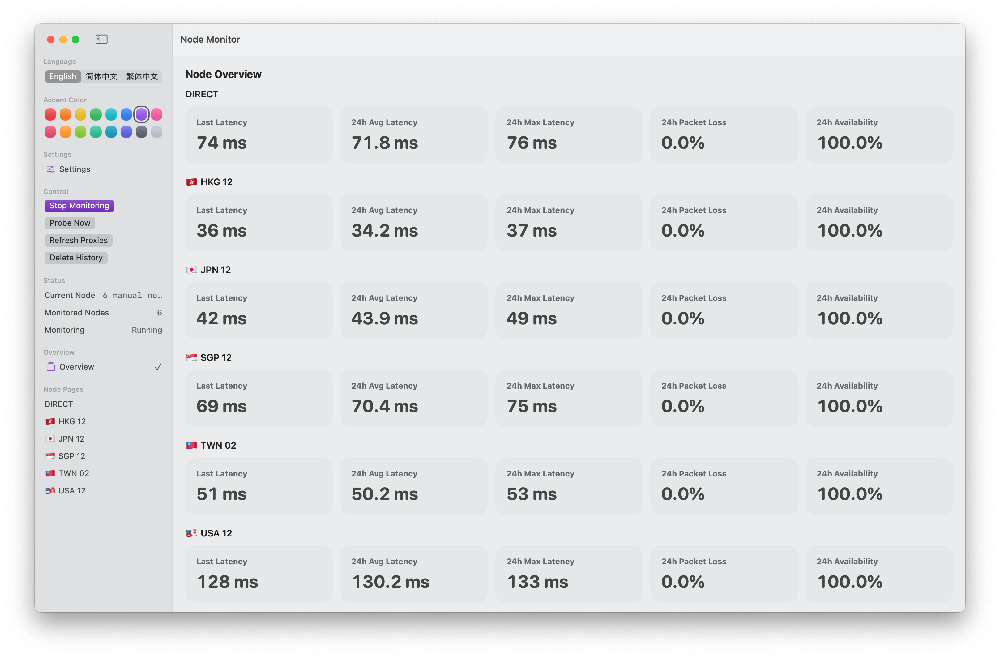
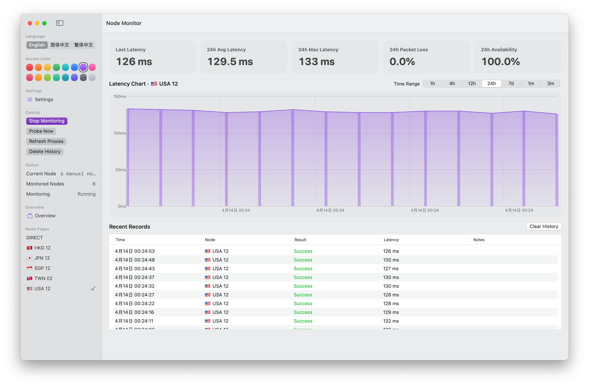

# Latency Graph for ClashX Meta


A native macOS menu bar app for monitoring ClashX Meta / Clash Meta proxy latency.

## Features

- Multi-node latency monitoring with per-node pages
- Overview page with 24h stats and combined latency chart
- Configurable probe interval, timeout, target URL, and sample count
- Menu bar panel with latest latency and recent trend
- Local SQLite history database
- English, Simplified Chinese, and Traditional Chinese UI

## Screenshots





## Requirements

- macOS 13+
- Xcode 15+ or Swift 5.9+
- ClashX Meta / Clash Meta with `external-controller` enabled

## Build

```bash
swift build
```

## Run

```bash
swift run
```

## Package

```bash
./scripts/package-app.sh
open "dist/Latency Graph for ClashX Meta.app"
```

## Data Location

Probe history is stored locally at:

```text
~/Library/Application Support/Latency Graph for ClashX Meta/probes.sqlite
```

Legacy `probes.json` data is imported automatically on first launch after upgrading to the SQLite version.

## Release

Download the latest signed ad-hoc macOS app archive from [GitHub Releases](https://github.com/HanBangyuan8/Latency-Graph-for-ClashX-Meta/releases).

Release notes are maintained in `CHANGELOG.md`.

## License

Copyright © 2026 Han. All rights reserved.

## Stargazers

[](https://starchart.cc/HanBangyuan8/Latency-Graph-for-ClashX-Meta)
